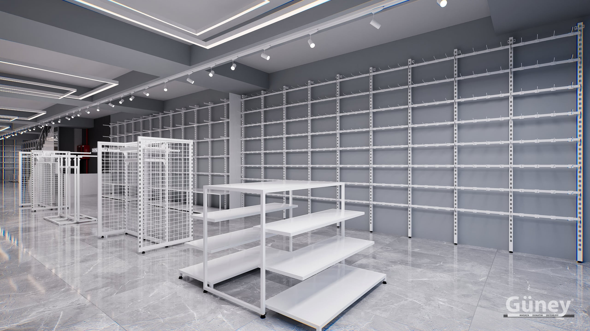

Ayakkabı mağazası dekorasyonu giyim mağazasından farklıdır. Ürünler küçük, model sayısı fazla, beden stoku ise büyüktür. Başarılı bir ayakkabı mağazası çok sayıda modeli düzenli gösterirken bedenleri hızla müşteriye ulaştırabilen mağazadır.

Aşağıda ayakkabı mağazası planlarken dikkat edilmesi gerekenleri sıraladık.

## Ayakkabı duvarı: mağazanın vitrini

Ayakkabı mağazalarında en etkili teşhir alanı duvardır. Modellerin yan yana ve sıra sıra dizildiği bir ayakkabı duvarı müşteriye tüm koleksiyonu tek bakışta gösterir.

### Raf aralığı ve derinlik
- **Sık raf aralığı:** Spor ayakkabı, babet ve sandaletler için.
- **Geniş raf aralığı:** Bot, çizme ve yüksek topuklu modeller için.
- **Sığ raf:** Ayakkabının tamamı görünsün, müşteri kolayca alabilsin.

Raf yüksekliği ayarlanabilen [40×40 raf sistemleri](/raf-sistemleri/40x40-raf/) sezon geçişlerinde (yazlıktan bota) duvarın yeniden düzenlenmesini sağlar.

### Raf açısı
Eğimli raflar ayakkabıyı müşteriye doğru gösterir; düz raflar daha fazla modeli sığdırır. Duvarın göz hizasındaki kısmında eğimli, alt ve üst kısımlarda düz raf kullanmak iyi bir dengedir.

## Modelleri gruplayın

Müşteri ayakkabı mağazasında genellikle bir ihtiyaçla gelir: spor, klasik, günlük veya özel gün. Duvarı bu ihtiyaçlara göre bölümlere ayırmak aradığını bulmasını hızlandırır:

- Kadın / erkek / çocuk
- Spor / günlük / klasik
- Yeni sezon / kampanya

Her bölümün başında o grubun en güçlü modelini göz hizasında göstermek dikkat çeker.

## Orta alan ve kampanya

Mağazanın ortasındaki alçak [orta üniteler](/orta-sistemleri/) kampanya ve yeni sezon modelleri için idealdir. Ayakkabının yanında çanta, çorap ve bakım ürünlerini sergilemek sepet tutarını artırır.

## Deneme alanını unutmayın

Ayakkabı mağazasında müşteri denemeden almaz. Rahat bir deneme alanı:

- Duvar raflarına yakın oturma birimleri,
- Zemine yakın, boy aynaları,
- Denenen ayakkabıların bırakılabileceği bir alan

içermelidir. Oturma birimlerinin altı küçük stok için de kullanılabilir.

## Depo: ayakkabı mağazasının kalbi

Ayakkabı mağazasında her modelin birçok bedeni vardır ve bunlar depoda durur. Satış hızını belirleyen, personelin doğru bedeni ne kadar hızlı bulduğudur. Depoda:

- Kutuları marka ve modele göre gruplayın,
- Bedenleri soldan sağa küçükten büyüğe dizin,
- Sık satılan modelleri depo girişine yakın raflara koyun.

Taşıma kapasitesi yüksek [metal depo rafları](/raf-sistemleri/depo-raf/) ayakkabı kutuları için uygundur. Daha fazlası için [mağaza deposu düzeni](/blog/magaza-deposu-duzeni/) yazımıza göz atabilirsiniz.

## Aydınlatma

Ayakkabı küçük bir ürün olduğu için iyi aydınlatılmadığında duvarda kaybolur. Ayakkabı duvarını önden aydınlatan spotlar ve raf altı aydınlatma, özellikle koyu renkli modellerin görünmesini sağlar.

## Ayakkabının yanında ne satılır?

Ayakkabı alan müşteri çoğu zaman tamamlayıcı ürünlere de açıktır. Bu ürünleri doğru yerde sergilemek sepet tutarını artırır:

- **Çorap:** Kasa önünde veya deneme alanının yanında, [bacak mankenleri](/mankenler/plastik-manken/) ile sergilenebilir.
- **Bakım ürünleri:** Boya, sprey ve fırçalar kasaya yakın küçük raflarda.
- **Çanta ve küçük deri ürünler:** Ayakkabıyla uyumlu renklerde, aynı duvarın bir bölümünde veya orta ünitede.
- **Tabanlık ve bağcık:** Deneme alanına yakın, kolay ulaşılan bir noktada.

Bu ürünler için küçük raflar veya ızgara panel üzerinde kancalar, ayakkabı duvarının düzenini bozmadan ek satış alanı oluşturur.

## Sık yapılan hatalar

1. **Her bedeni sergilemek:** Raf dolar, model sayısı azalır; bedenleri depoda tutun.
2. **Çok derin raf:** Arka taraftaki ayakkabı görünmez ve müşteri ulaşamaz.
3. **Deneme alanını sona bırakmak:** Oturma alanı olmayan mağazada müşteri denemeden çıkar.
4. **Depoyu plansız bırakmak:** Bedeni bulamayan personel satışı kaçırır.

Ayakkabı mağazanız için duvar ve depo sistemini birlikte planlayalım. Mağazanızın ölçüsünü ve fotoğraflarını gönderin; [projelerimiz](/projeler/) arasında ayakkabı mağazası uygulamalarımızı da görebilirsiniz.
