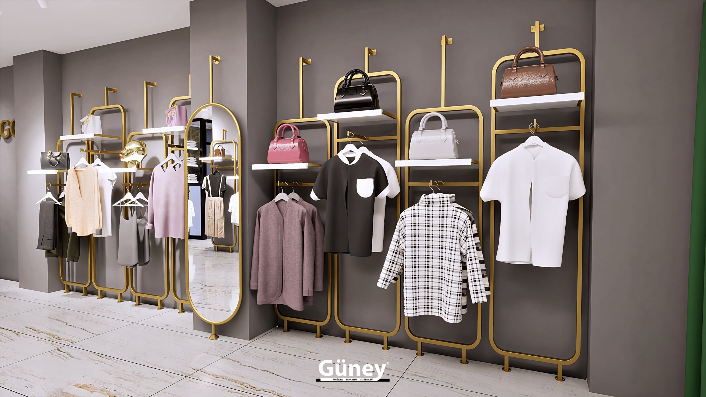
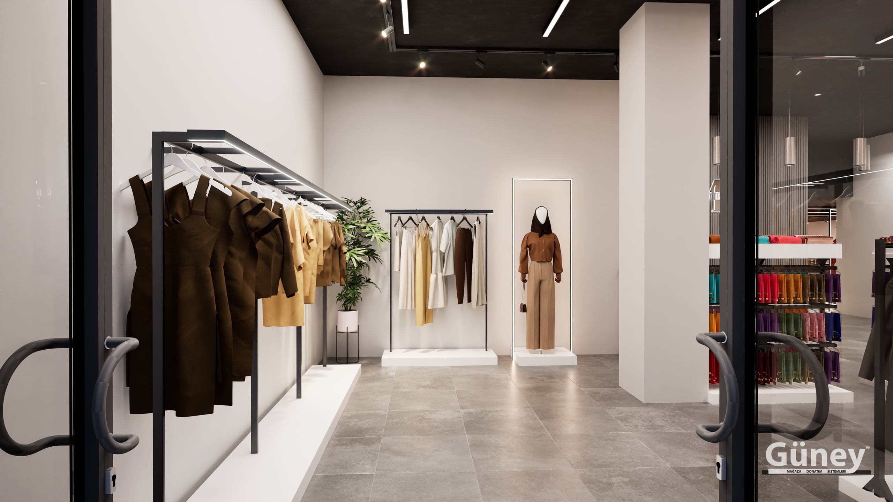

Butik mağazada her metrekare önemlidir. Geniş bir mağazanın yapabildiği gibi ürünü bol bol sergilemek yerine, daha az ürünü daha iyi göstermek gerekir. Doğru dekorasyon butiğin kimliğini ilk bakışta anlatır.

Aşağıdaki fikirleri tasarladığımız ve kurduğumuz mağaza projelerinden derledik.

## 1. Kemerli askılıklarla karakter kazanın

Düz askılık boruları işlevseldir ama karakter taşımaz. Kemerli ve altın rengi askılık sistemleri mağazaya ilk bakışta tanınan bir kimlik kazandırır. Kemer formu duvarı bölümlere ayırır; her bölüm ayrı bir kombin veya koleksiyon için sahne olur.

## 2. Duvarı kombin sahnesine çevirin

Butikte duvar sadece stok alanı değildir. Askılık ve rafı birlikte kullanarak üst kısma çanta ve aksesuar, ortaya askıda kombin, alta katlı ürün yerleştirmek müşteriye hazır bir kombin fikri verir. Satış çoğu zaman tek parça değil bütün kombin olarak gerçekleşir.

## 3. Ahşap ve metali birlikte kullanın

Siyah metal ile ahşap raf kombinasyonu sıcak ama modern bir atmosfer yaratır. Metal taşıyıcı sağlamlık verir, ahşap yüzey ise ürünü yumuşak bir zemine oturtur. Bu kombinasyon özellikle erkek giyim, denim ve konsept mağazalarda güçlü bir etki bırakır.

## 4. Mağazanın ortasını boş bırakmayın

Orta alan müşteriyi mağazanın içine çeker. Kampanya ürünlerini, yeni sezonu veya en çok satanları sergileyen bir [orta ünite](/orta-sistemleri/) müşterinin dolaşım yolunu belirler. Butiklerde alçak teşhir masaları görüşü kapatmadığı için mağazayı daha ferah gösterir.

## 5. Vitrinde tek bir güçlü mesaj verin

Vitrinde çok fazla ürün yerine bir veya iki güçlü kombin kullanın. Parlak altın veya gümüş yüzeyli [polyester mankenler](/mankenler/polyester-manken/) sade kıyafetleri bile dikkat çekici kılar. Vitrini sezonda birkaç kez yenilemek müşteriye mağazada her zaman yeni bir şey olduğu hissini verir.

## 6. Açık renk zeminle ferahlık yaratın

Küçük butiklerde beyaz veya açık gri duvar sistemleri alanı olduğundan büyük gösterir. Ürünlerin renkleri açık zeminde daha canlı görünür. Koyu renkli sistemler ise daha geniş mağazalarda premium bir hava verir.

## 7. Esnek ekipman kullanın

Butiklerde sezon geçişi hızlıdır. Tekerlekli [konfeksiyon askılıkları](/standlar/) yeni gelen ürünleri hızla sergilemeyi ve kampanya alanını bir günde yeniden düzenlemeyi sağlar. Modüler raf sistemleri de raf yüksekliklerini ürüne göre değiştirmenize imkân verir.

## Aydınlatma: butiğin görünmez dekoru

Butikte aydınlatma en az raf kadar önemlidir:

- **Genel aydınlatma** mağazanın tamamını eşit aydınlatır.
- **Vurgu aydınlatma** (spotlar) duvar kombinlerini ve vitrini öne çıkarır.
- **Dekoratif aydınlatma** (avizeler, ışıklı nişler) mağazanın karakterini belirler.

Duvar sistemleri ve orta üniteler, spotların ürünü doğru açıdan aydınlatacağı şekilde konumlandırılmalıdır.

## Kasa ve deneme kabini alanını unutmayın

Butiklerde kasa ve deneme kabini genellikle en son düşünülür ama müşteri deneyimini doğrudan etkiler:

- Kasa önü, küçük aksesuar ve son dakika ürünleri için değerli bir teşhir alanıdır.
- Deneme kabinlerinin yakınına bir ayna ve kısa bir askılık koymak, müşterinin denediği ürünleri bırakacağı düzenli bir alan yaratır.
- Kasa arkası duvar, logo ve marka kimliği için doğal bir sahnedir.

## Butiklerde sık yapılan hatalar

1. **Her duvarı doldurmak:** Boşluk, ürünün değerli görünmesini sağlar.
2. **Çok fazla stil karıştırmak:** Metal, ahşap ve renk seçiminde tutarlı kalmak mağazayı daha kurumsal gösterir.
3. **Vitrini ihmal etmek:** Butiğe gelen müşterilerin çoğu vitrindeki bir üründen etkilenerek içeri girer.
4. **Orta alanı fazla doldurmak:** Dar geçişler müşterinin mağazada vakit geçirmesini zorlaştırır.

## Bir butik projesi nasıl planlanır?

1. **Kimliği belirleyin:** Minimal mi, lüks mü, sıcak mı? Renk ve malzeme buna göre seçilir.
2. **Duvarları bölümleyin:** Her bölüm bir ürün grubu veya kombin için.
3. **Orta alanı planlayın:** Dolaşımı kapatmayan, kampanyaya açık üniteler.
4. **Vitrini tasarlayın:** Tek güçlü mesaj, iyi ışık.

Butiğinizin ölçüsünü ve birkaç fotoğrafını gönderin, projelerimizden edindiğimiz deneyimle size özel bir yerleşim önerelim. Diğer uygulamalarımızı [projelerimiz](/projeler/) sayfasında görebilirsiniz.
