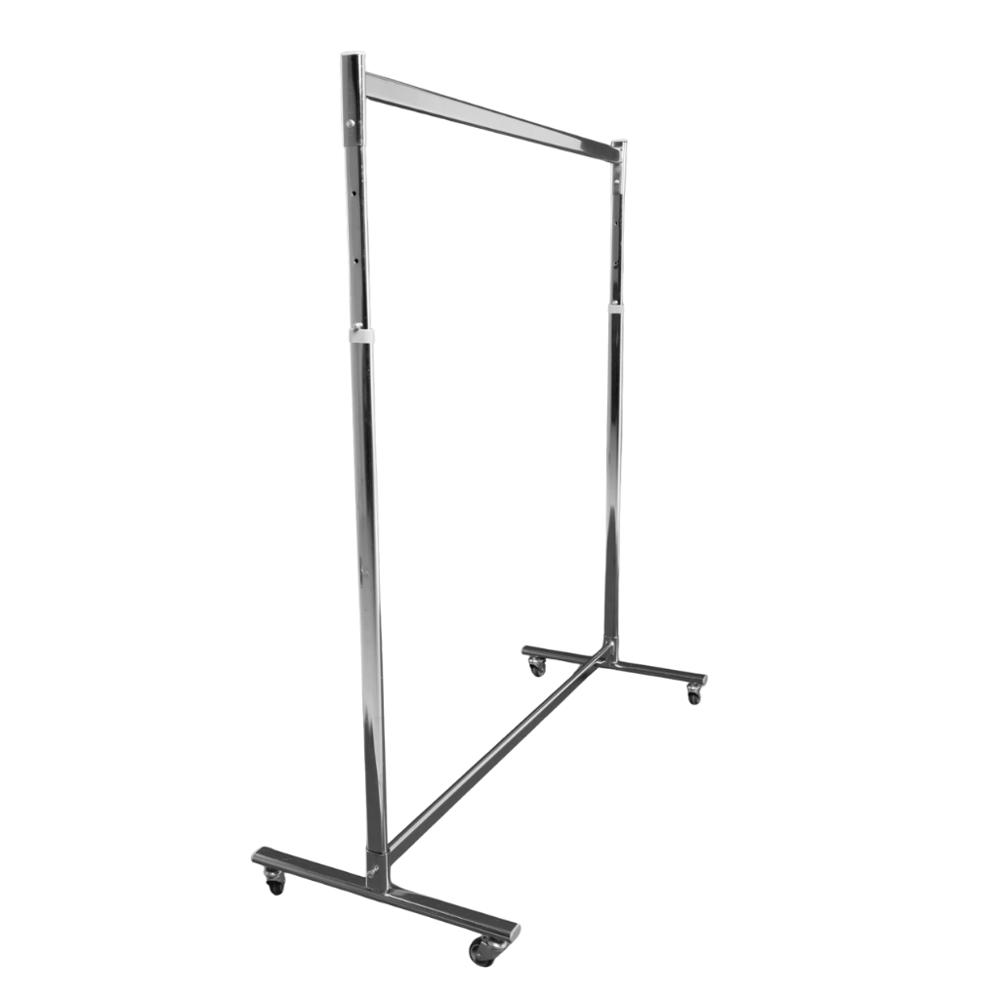

Konfeksiyon askılığı mağazanın en çok çalışan ekipmanlarından biridir. Yeni gelen ürünün sergilendiği, kampanya alanının kurulduğu, sezon geçişinde ürünlerin taşındığı yer çoğu zaman tekerlekli bir askılıktır.

Doğru askılık yıllarca sorunsuz çalışır; yanlış seçilen askılık ise ilk yoğun sezonda eğilir ya da tekerlekleri bozulur. Bu rehberde seçim yaparken dikkat edilmesi gerekenleri anlatıyoruz.

## Konfeksiyon askılığı nerelerde kullanılır?

- **Mağaza içi:** Yeni sezon ve kampanya alanları, deneme kabini önü.
- **Showroom ve fuar:** Koleksiyon sunumları ve toptan satış.
- **Atölye:** Üretim hattından çıkan ürünlerin bekletilmesi.
- **Depo ve sevkiyat:** Askılı ürünlerin taşınması ve sevkiyat hazırlığı.

## 1. Tek mi, çift borulu mu?

- **Tek borulu askılık:** Daha az yer kaplar; mağaza içinde ve dar alanlarda kullanışlıdır.
- **Çift borulu askılık:** Aynı alanda iki kat ürün taşır; depo, showroom ve sevkiyat için daha verimlidir.

Mağaza içinde müşterinin her iki taraftan ürüne ulaşabileceği yerleşimler için tek borulu, stok taşıma için çift borulu modeller genellikle daha uygundur.

## 2. Gövde ve malzeme

Askılığın taşıyacağı yük sezona göre çok değişir. Kışın mont ve kaban dolu bir askılık, yazın tişört asılı bir askılıktan çok daha ağırdır. Bu yüzden:

- Sağlam, kalın profilli metal gövde,
- Borunun gövdeye bağlandığı noktanın sağlamlığı,
- Ağırlığı dengeli taşıyan geniş bir taban

önemlidir.

## 3. Tekerlekler

Tekerlekli askılıkta en çok yıpranan parça tekerlektir. Dikkat edilmesi gerekenler:

- **Frenli tekerlek:** Mağaza içinde askılığın sabit durması için en az iki tekerleğin frenli olması önerilir.
- **Zemine uygun tekerlek:** Parke ve seramik zeminde iz bırakmayan tekerlekler tercih edilmelidir.
- **Kolay dönen tekerlekler:** Dolu askılığın rahat hareket etmesi personelin işini kolaylaştırır.

## 4. Yükseklik ayarı

Yüksekliği ayarlanabilen askılıklar hem kısa ürünler (gömlek, ceket) hem uzun ürünler (elbise, palto) için kullanılabilir. Uzun ürünlerin yere değmemesi için askı borusunun yeterli yüksekliğe ulaşabilmesi gerekir.

## 5. Renk: krom mu, siyah mı?

- **Krom:** Modern, parlak ve temiz bir görünüm verir; açık renkli mağazalarla uyumludur.
- **Siyah:** Endüstriyel ve minimal konseptlerle uyumludur; siyah metal raf sistemi kullanan mağazalarda bütünlük sağlar.

Mağazadaki raf ve orta ünitelerle aynı renk dilini kullanmak mağazanın düzenli görünmesini sağlar.

## Kullanım ve bakım

- Askılığı kapasitesinin üzerinde yüklemeyin; ağırlığı borunun ortasında toplamak yerine eşit dağıtın.
- Dolu askılığı hareket ettirirken gövdeden itin, borudan çekmeyin.
- Tekerlekleri düzenli olarak temizleyin; iplik ve toz birikintisi dönmeyi zorlaştırır.
- Bağlantı vidalarını belirli aralıklarla kontrol edin.

## Kaç askılık gerekir?

Askılık sayısı kullanım amacına göre değişir:

- **Mağaza içi kampanya alanı:** Girişe yakın bir veya iki askılık, kampanyayı görünür kılmaya yeter. Daha fazlası mağazayı kalabalık gösterir.
- **Deneme kabini önü:** Denenen ve iade edilen ürünler için bir askılık, kabin önünün dağılmasını önler.
- **Sezon geçişi:** Yeni gelen ürünleri raflara yerleştirmeden önce bekletmek için birkaç ek askılık işleri hızlandırır.
- **Depo ve sevkiyat:** Günlük sevkiyat hacmine göre; bir askılığın dolup boşalma süresi planlanmalıdır.

Kullanılmadığında askılıkları depoda tutmak, mağazanın ihtiyaç anında esnek kalmasını sağlar.

## Özetle

| Karar | Mağaza içi | Depo ve sevkiyat |
|---|---|---|
| Boru sayısı | Tek boru | Çift boru |
| Tekerlek | Frenli, iz bırakmayan | Sağlam, kolay dönen |
| Renk | Mağaza konseptine uygun | Fark etmez |
| Öncelik | Görünüm ve esneklik | Kapasite ve dayanıklılık |

Tüm modelleri [standlar](/standlar/) sayfasında krom ve siyah seçenekleriyle inceleyebilir, ihtiyacınız olan adedi teklif listesine ekleyebilirsiniz.
