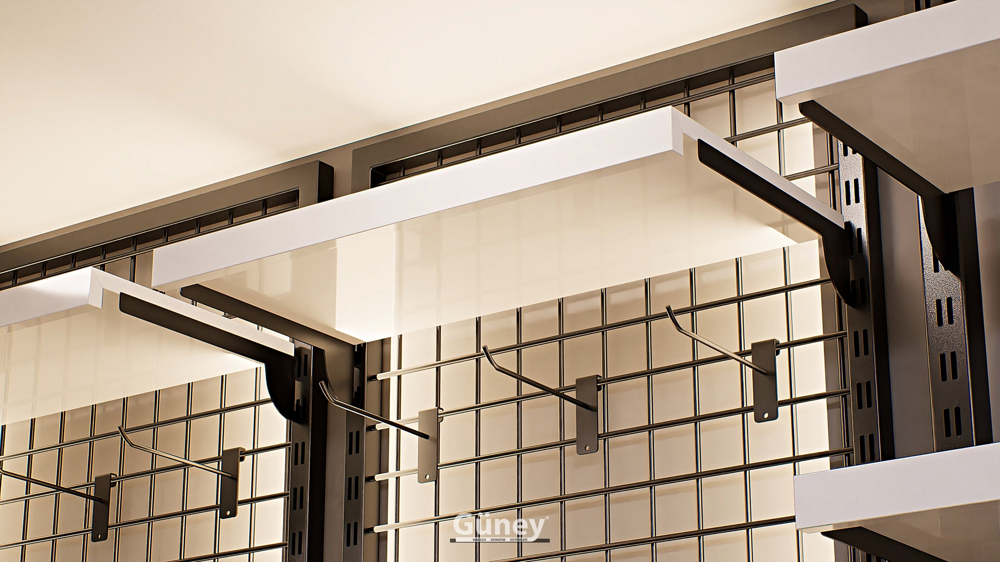

Küçük mağazada asıl zorluk, ürünü sığdırmak değil sığdırırken mağazayı kalabalık göstermemektir. Doğru teşhir çözümleriyle küçük bir mağaza hem çok ürün taşıyabilir hem de ferah ve düzenli görünebilir.

Aşağıda projelerimizden edindiğimiz deneyimle alan kazandıran 8 fikri derledik.

## 1. Duvarı tavana kadar kullanın

Küçük mağazada en büyük alan duvarlardır. Duvarı tavana kadar değerlendiren raf sistemleri zemin alanını boşaltır. Üst raflar stok ve görsel teşhir için, göz hizası ve altı satış için kullanılır.

Raf yükseklikleri ayarlanabilen [40×40 raf sistemleri](/raf-sistemleri/40x40-raf/) sezon değiştikçe duvarın yeniden düzenlenmesini sağlar.

## 2. Askı ve rafı aynı sistemde birleştirin

Ayrı askılık ve ayrı raf yerine, aynı duvar sisteminde askı borusu ve rafı birlikte kullanmak alanı ikiye katlar. Üstte katlı ürün, altta askıda ürün tek duvarda iki ürün grubunu taşır.

## 3. Orta alanı alçak tutun

Küçük mağazada yüksek orta üniteler mağazanın arkasını gizler ve alanı daha küçük gösterir. Alçak bir teşhir masası veya bel hizasında bir karma ünite, geçişi daraltmadan kampanya alanı oluşturur.

## 4. Parça manken kullanın

Tam boy manken zeminde ciddi yer kaplar. Raf veya tezgâh üzerine konan [gövde mankenleri](/mankenler/plastik-manken/), kafa ve bacak mankenleri ürünü göz hizasına taşır ve zemini boş bırakır.

## 5. Izgara panel ve kanca kullanın

Aksesuar, çanta, şapka ve küçük ürünler için ızgara paneller duvarın dikey alanını verimli kullanır. Kancalar sonradan yer değiştirebildiği için düzen sezona göre kolayca güncellenir.

## 6. Açık renk ve ışıkla ferahlık yaratın

Beyaz veya açık renkli raf sistemleri ve duvarlar küçük mağazayı olduğundan büyük gösterir. Raf sistemlerinin iyi aydınlatılması da derinlik hissi verir; karanlık köşeler mağazayı küçültür.

## 7. Taşınabilir ekipmanla esnek kalın

Tekerlekli [konfeksiyon askılıkları](/standlar/) yeni gelen ürünleri hızla sergilemeyi, kampanya dönemlerinde de alanı bir günde yeniden düzenlemeyi sağlar. Kullanılmadığında depoya çekilebilir.

## 8. Depoyu da düzenleyin

Küçük mağazaların satış alanı genellikle depo yetersizliği yüzünden dolar. Arka taraftaki küçük bir depo bile doğru [depo rafıyla](/raf-sistemleri/depo-raf/) düzenlenirse satış alanındaki fazla stok ortadan kalkar. Ayrıntılar için [mağaza deposu düzeni](/blog/magaza-deposu-duzeni/) yazımıza göz atın.

## Ayna ve ışıkla alanı büyütün

Küçük mağazada ayna yalnızca deneme için değil, alanı büyük göstermek için de kullanılır:

- **Boy aynası** duvar sistemlerinin arasına yerleştirildiğinde mağazayı derin gösterir ve müşterinin ürünü denemeden üzerinde görmesini sağlar.
- **Işığı yansıtan yüzeyler** (açık renkli raflar, cam bölmeler) mağazanın her köşesinin aydınlık görünmesine yardımcı olur.
- **Arka duvarı aydınlatmak** müşterinin gözünü mağazanın sonuna kadar taşır; mağaza girişten bakıldığında daha uzun görünür.

Deneme kabini için ayrı bir oda ayıramıyorsanız, köşeye yerleştirilen perdeli küçük bir kabin ve yanında boy aynası, alanı en az kullanan çözümdür.

## Küçük mağaza planlarken 4 kural

1. **Önce duvar, sonra orta:** Duvarları tam kullanmadan orta alana ünite eklemeyin.
2. **Geçişi koruyun:** Müşterinin rahatça dolaşabileceği bir yol bırakın.
3. **Tek renk dili:** Farklı renk ve malzemeler küçük alanda karmaşa yaratır.
4. **Az ama doğru ürün:** Her ürünün tek bir örneğini sergileyip bedenleri depoda tutmak raf görüntüsünü sadeleştirir.

## Sık yapılan hatalar

- **Her boşluğu doldurmak:** Nefes alan boşluklar ürünü daha değerli gösterir.
- **Zemine koli ve stok bırakmak:** Satış alanını daraltır, mağazayı dağınık gösterir.
- **Koyu ve ağır malzemeler:** Küçük alanda mağazayı olduğundan dar gösterir.

Mağazanızın ölçüsünü ve birkaç fotoğrafını gönderin, küçük alanınızı en verimli şekilde kullanacak yerleşimi birlikte planlayalım. [Raf sistemleri](/raf-sistemleri/) sayfasından modelleri inceleyebilirsiniz.
