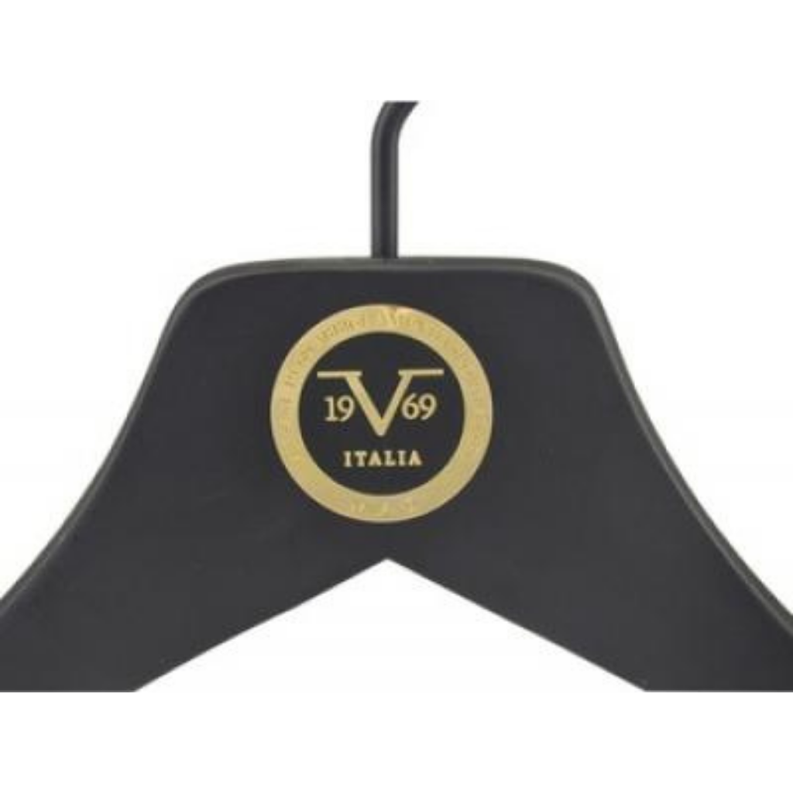

Askı, müşterinin ürünle birlikte eline aldığı ilk şeydir. Üzerinde markanızın logosu olan bir askı, ürün raftan alındığı andan itibaren markayı hatırlatır. Bu yüzden premium mağazalar, oteller ve kurumsal markalar logo baskılı askıyı marka kimliğinin bir parçası olarak görür.

Bu yazıda logo baskılı askı yaptırmadan önce bilinmesi gerekenleri anlatıyoruz.

## Logo baskılı askı kimler için uygundur?

- **Premium giyim mağazaları:** Ürünün değerini artıran kurumsal bir görünüm için.
- **Butikler:** Marka kimliğini raftan kasaya kadar tutarlı göstermek için.
- **Oteller:** Oda dolaplarında kaliteli ve kurumsal bir detay olarak.
- **Kurumsal hediye ve promosyon:** Takım elbise veya gömlek hediyelerinde.

## 1. Askı modelini seçin

Baskı, askının kendisinden bağımsız düşünülemez. Önce askının ne için kullanılacağını belirleyin:

- **Ceket ve takım:** Geniş omuzlu askılar; logo için geniş bir yüzey sunar.
- **Gömlek ve bluz:** İnce omuzlu askılar; logo daha küçük ölçekte uygulanır.
- **Pantolon:** Mandallı askılar; logo çıta üzerine uygulanabilir.

Ahşap ve plastik askı seçenekleri hakkında ayrıntılı bilgi için [mağaza askısı seçim rehberimize](/blog/magaza-askisi-secim-rehberi/) göz atabilirsiniz.

## 2. Malzeme ve rengi belirleyin

Askının rengi logonun nasıl görüneceğini belirler:

- **Naturel ahşap üzerinde** koyu veya metalik logolar,
- **Siyah askı üzerinde** altın, gümüş veya beyaz logolar,
- **Beyaz askı üzerinde** koyu renkli logolar

en okunaklı sonucu verir. Logonun rengiyle askının rengi arasında yeterli kontrast olmalıdır.

## 3. Baskı türü

Askılara uygulanan başlıca baskı türleri:

- **Yaldız baskı:** Altın, gümüş veya renkli folyo ile parlak ve premium bir görünüm verir. Siyah ve koyu renkli askılarda özellikle etkilidir.
- **Tampon baskı:** Logonun rengini doğrudan askı yüzeyine aktarır; çok renkli logolarda ve detaylı çizimlerde kullanılır.

Bazı modellerde logo, askıya takılan metal plaka ile de uygulanır. Farklı markalar için yaptığımız uygulamaları [baskılı askı](/askilar/baskili-aski/) sayfasında görebilirsiniz.

## 4. Logonuzu hazırlayın

Temiz bir baskı için logonun doğru dosya formatında olması önemlidir:

- **Vektörel dosya** (PDF, AI, EPS veya SVG) en iyi sonucu verir.
- **İnce çizgiler ve çok küçük yazılar** askı üzerinde okunmayabilir; sade bir logo versiyonu daha iyi sonuç verir.
- **Renk bilgisi:** Kurumsal renk kodunuz varsa (Pantone gibi) paylaşın.

## 5. Önizleme ve onay

Baskıya geçmeden önce askı modeli, rengi, logonun boyutu ve konumu birlikte netleştirilir. Onaylanan tasarıma göre üretime geçilir.

## Ahşap mı, plastik mi?

Logolu askı yaptırırken en önemli kararlardan biri malzemedir:

- **Ahşap askı** premium bir his verir; ceket, takım ve palto gibi yüksek değerli ürünlerde markanın kalite mesajını güçlendirir. Otel ve butiklerde en çok tercih edilen seçenektir.
- **Plastik askı** hafif ve ekonomiktir; yüksek adetli kullanımda maliyet avantajı sağlar. Parlak ve metalik yüzeyli modellerle premium bir görünüm de elde edilebilir.

Pek çok marka ikisini birlikte kullanır: vitrin ve premium ürünlerde logolu ahşap askı, mağazanın genelinde logolu plastik askı. Böylece bütçe dengelenirken marka görünürlüğü her yerde korunur.

## Sipariş öncesi ipuçları

1. **Adedi sezon ihtiyacına göre planlayın:** Farklı üretim partileri arasında renk ve malzeme tonunda küçük farklar olabileceğinden, başlangıçta yeterli adet planlamak mağazadaki askıların birebir aynı görünmesini sağlar.
2. **Farklı ürünler için tek dil:** Ceket, gömlek ve pantolon askıları farklı model olsa da aynı renk ve logo uygulamasını kullanmak mağazada bütünlük sağlar.
3. **Kasa ve paketleme:** Logolu askılar kasa arkasında ve paketlemede de markanın görünürlüğünü artırır.

## Sık yapılan hatalar

- **Çok büyük logo:** Askıyı kalabalık gösterir; sade ve orantılı bir logo daha şık durur.
- **Yetersiz kontrast:** Askı rengine yakın bir logo rengi okunmaz.
- **Düşük çözünürlüklü dosya:** Baskıda kenarların bulanık çıkmasına neden olur.

Logonuzu ve kullanmak istediğiniz askı modelini WhatsApp üzerinden gönderin, size uygun baskı seçeneğini birlikte belirleyelim.
