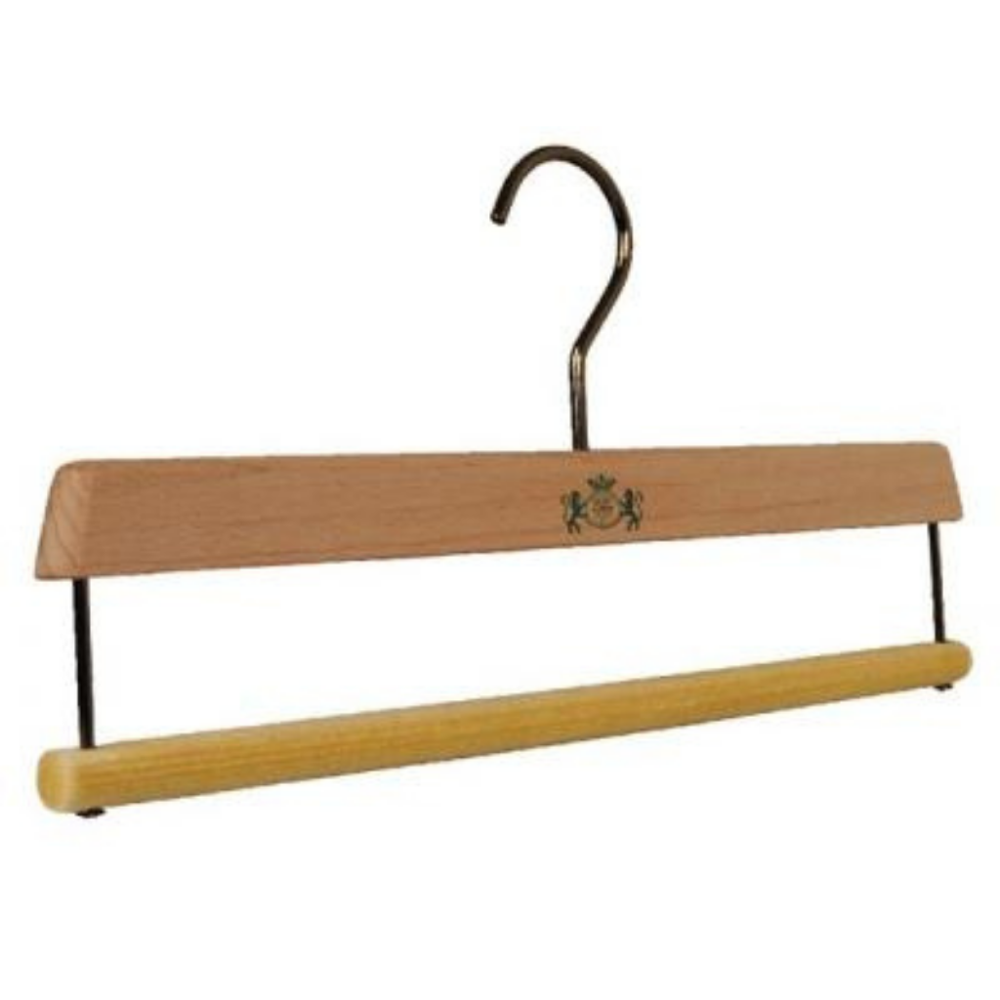

Askı mağazada en çok göz önünde olan ama en az düşünülen ekipmandır. Oysa müşteri bir ürünü eline aldığında ilk dokunduğu şey çoğu zaman askıdır. Doğru askı kıyafetin formunu korur, raf düzenini sadeleştirir ve markanın kalitesini yansıtır.

Bu rehberde askı malzemelerini, ürün tipine göre doğru modelleri ve logo baskılı askıyı anlatıyoruz.

## Malzemeye göre askılar

### Ahşap askı
Premium mağazaların tercihidir. Kıyafete değer katar, ağırlığı sayesinde ürünün düzgün durmasını sağlar. Naturel, kahverengi, siyah, beyaz ve renkli boya seçenekleri bulunur.

- **En uygun:** Ceket, takım elbise, palto, gömlek, premium triko.
- [Ahşap askı modelleri](/askilar/ahsap-aski/)

### Plastik askı
Hafif, dayanıklı ve ekonomiktir. Yüksek adet ihtiyacı olan mağazaların ilk tercihidir. Parlak ve metalik (altın, gümüş) yüzeyli premium modelleri de vardır.

- **En uygun:** Günlük giyim, tişört, gömlek, iç giyim, mayo; toptan kullanım.
- [Plastik askı modelleri](/askilar/plastik-aski/)

### Metal askı ve kanca
İnce profili sayesinde raf ve duvar sistemlerinde yer kazandırır. Mandallı kancalar çorap ve küçük aksesuarı, eşarp askıları tek askıda birden fazla ürünü düzenli gösterir.

- **En uygun:** Aksesuar, çorap, eşarp ve şal, mayo ve iç giyim.
- [Metal askı modelleri](/askilar/metal-aski/)

## Ürün tipine göre doğru askı

| Ürün | Önerilen askı | Neden? |
|---|---|---|
| Ceket, takım | Geniş omuzlu ahşap veya plastik ceket askısı | Omuz formunu korur |
| Pantolon, etek | Mandallı pantolon askısı | Ürünü kırıştırmadan tutar |
| Bluz, elbise | İnce omuzlu bluz askısı, çentikli model | Askılı ürünler kaymaz |
| Çocuk giyim | Çocuk askısı | Küçük bedenlerde omuz taşmaz |
| Mayo, iç giyim | Tel veya şeffaf mayo askısı | Ürünün formunu gösterir |
| Eşarp, şal | Halka eşarp veya şal askısı | Tek askıda çoklu sunum |
| Çorap, aksesuar | Mandallı kanca, S kanca | Az yer kaplar |

## Tek tip askının gücü

Mağazada farklı renk ve modelde askıların karışık kullanılması raf görüntüsünü dağınık gösterir. Aynı renk ve modelde askı kullanmak:

- Raf hizasını düzeltir,
- Ürünler arasındaki mesafeyi eşitler,
- Mağazaya kurumsal ve bakımlı bir görünüm kazandırır.

Ceket ve pantolonda farklı modeller gerekse bile aynı renk ailesinde kalmak bütünlüğü korur.

## Logo baskılı askı

Logo baskılı askı markayı kıyafetin ilk dokunduğu noktaya taşır. Özellikle premium mağazalarda, otellerde ve kurumsal hediyelerde tercih edilir.

- **Baskı türleri:** Yaldız ve tampon baskı.
- **Malzeme:** Ahşap ve plastik askılar.
- **Süreç:** Askı modeli, renk ve baskı rengi birlikte seçilir; onaydan sonra üretime geçilir. Logo dosyanızı WhatsApp'tan gönderebilirsiniz.

Farklı markalar için ürettiğimiz örnekleri [baskılı askı](/askilar/baskili-aski/) sayfasında görebilirsiniz.

## Askı ve marka algısı

Müşteri raftan bir ürün aldığında askıyı da eline alır. İnce ve eğilen bir askı ürünü ucuz gösterirken, sağlam ve kaliteli bir askı ürünün değerini artırır. Premium mağazaların ahşap veya logo baskılı askı kullanmasının nedeni budur: askı, markanın kalite mesajının bir parçasıdır.

Özellikle:

- **Ceket ve takım** gibi yüksek fiyatlı ürünlerde geniş omuzlu, sağlam askı,
- **Vitrin ve kampanya alanında** mağazanın genelinden farklı, dikkat çekici askı,
- **Kasa önünde ve paketlemede** logolu askı

marka algısını güçlendirir.

## Sık yapılan hatalar

1. **Her ürüne aynı askıyı kullanmak:** Pantolon için mandallı, bluz için çentikli askı gerekir; yanlış askı ürünün düşmesine veya iz kalmasına yol açar.
2. **Omuz genişliğini dikkate almamak:** Büyük askı küçük bedende omuzda iz bırakır, küçük askı ceketin formunu bozar.
3. **Farklı markalardan karışık askı almak:** Renk ve boy farkları raf görüntüsünü dağınık gösterir.
4. **Çok az stokla başlamak:** Aynı modeli sonradan bulmak zorlaşabilir; ilk siparişte yedek pay bırakmak daha güvenlidir.

## Askıların ömrünü uzatmak

- Ahşap askıları nemden uzak tutun, nemli bezle silip hemen kurulayın.
- Plastik askılarda aşırı yüklemeden kaçının; ağır montlar için ceket askısı kullanın.
- Metal kanca ve mandallarda mandal yayını zorlamayın.

## Sipariş öncesi 3 ipucu

1. **Adedi raf uzunluğuna göre hesaplayın.** Askılık boru uzunluğu ve ürün yoğunluğu gereken askı sayısını belirler.
2. **Yedek pay bırakın.** Sezon geçişlerinde ve yeni ürün girişinde ek askıya ihtiyaç olur.
3. **Koli bilgisini sorun.** Plastik askılar koli bazında gönderilir; koli adedi bilinen modellerde bu bilgi ürün sayfasında yazılıdır.

Tüm askı modellerini [askılar](/askilar/) sayfasında malzeme ve renge göre filtreleyebilirsiniz.
