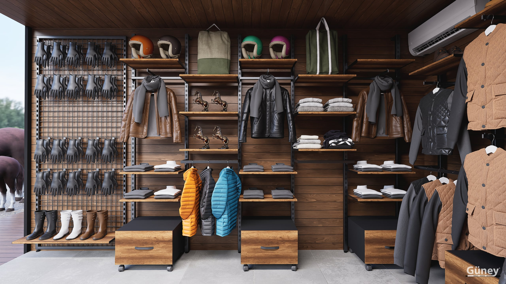

Yeni bir mağaza açarken ya da mevcut mağazayı yenilerken en çok sorulan soru şu: **“Bu iş nasıl ilerliyor ve ne kadar sürüyor?”** Mağaza dekorasyonu tek seferlik bir satın alma değil; ölçü, tasarım, üretim ve montajın birbirine bağlı ilerlediği bir süreç.

Bu yazıda bir mağaza projesinin ilk telefondan anahtar teslimine kadar nasıl ilerlediğini, her adımda sizden ne beklendiğini ve süreleri anlatıyoruz.

## 1. Keşif ve ihtiyaç analizi

Her proje mağazanın kendisiyle başlar. Keşifte mağazanın ölçüsü alınır, ama asıl amaç sadece metrekareyi öğrenmek değildir:

- **Duvar uzunlukları ve tavan yüksekliği:** Raf sistemlerinin kaç modül olacağını ve kaç kat çıkacağını belirler.
- **Elektrik, priz ve aydınlatma noktaları:** Raf ve orta ünitelerin bunlarla çakışmaması gerekir.
- **Giriş, vitrin ve kasa konumu:** Müşterinin mağaza içindeki dolaşım yolunu belirler.
- **Ürün grubu ve stok miktarı:** Askıda mı katlı mı sergileneceği, depo ihtiyacı.

> **İpucu:** Keşiften önce mağazanın birkaç fotoğrafını ve kabaca ölçüsünü WhatsApp'tan göndermek süreci hızlandırır. Çoğu zaman ilk fiyat aralığı bu bilgilerle çıkarılabilir.

## 2. Tasarım ve teklif

Keşif bilgileriyle mağazaya özel bir yerleşim planı hazırlanır. Bu aşamada şu kararlar netleşir:

### Duvar sistemleri
Duvarlarda hangi raf sisteminin kullanılacağı ürün grubuna göre seçilir. Giyimde askı ve raf kombinasyonu öne çıkarken ayakkabı ve aksesuarda raf derinliği ve raf sayısı daha önemlidir. Farklı sistemleri [raf sistemleri](/raf-sistemleri/) sayfasında inceleyebilirsiniz.

### Orta alan
Mağazanın ortası kampanya ve yeni sezon ürünleri için kullanılır. [Orta sistemleri](/orta-sistemleri/) müşteriyi mağazanın içine doğru çeker; yerleşimleri geçiş yollarını kapatmayacak şekilde planlanmalıdır.

### Renk ve malzeme
Metal aksamın rengi (siyah, beyaz, altın, gümüş), raf yüzeyleri ve ahşap detaylar markanın görünümüne göre seçilir. Bütün mağazada aynı renk dilini kullanmak daha düzenli ve kurumsal bir görüntü sağlar.

Tasarım onaylandığında teklif netleşir ve üretim planına alınır.

## 3. Üretim

Onaydan sonra üretim ortalama **7–15 gün** sürer. Süre projenin büyüklüğüne, modül sayısına ve seçilen malzemeye göre değişir.

Üretim aşamasında sizden bir şey yapmanız beklenmez; ancak mağazadaki tadilat (boya, zemin, elektrik) varsa bu süre içinde tamamlanması montajı hızlandırır. Montaj ekibi geldiğinde duvarların boyanmış ve zeminin bitmiş olması en temiz sonucu verir.

## 4. Lojistik, montaj ve teslim

Üretilen parçalar mağazaya sevk edilir ve kendi montaj ekibimizle kurulur. Montaj proje büyüklüğüne göre **1–3 gün** içinde tamamlanır. Türkiye'nin her iline kurulum yapıyoruz.

Montaj sonrası:

1. Bütün modüllerin terazisi ve sabitlemesi kontrol edilir.
2. Raf aralıkları ürünlerinize göre son kez ayarlanır.
3. Mağaza temiz şekilde teslim edilir.

Ürün ve işçilikte **2 yıl garanti** veriyoruz; montajdan sonra da destek ekibimize ulaşabilirsiniz.

## Keşif öncesi hazırlık listesi

Keşif görüşmesine şu bilgilerle gelirseniz ilk toplantıda çok daha net bir tablo ortaya çıkar:

- **Mağazanın planı veya kabaca çizimi:** Duvar uzunlukları, kolonlar, pencere ve kapılar.
- **Satılacak ürün grupları ve yaklaşık stok miktarı:** Askıda ve katlı duracak ürünlerin oranı.
- **Beğendiğiniz mağaza örnekleri:** Fotoğraflar tarzı anlatmanın en hızlı yoludur.
- **Marka renkleri ve logosu:** Raf, askı ve ünitelerin renk seçimini kolaylaştırır.
- **Açılış tarihi ve tadilat takvimi:** Üretim ve montajın planlanması için gereklidir.

## Maliyeti belirleyen başlıca etkenler

Mağaza dekorasyonunda fiyatı metrekareden çok şu etkenler belirler:

1. **Duvar uzunluğu ve modül sayısı:** Raf sistemi ne kadar uzun, o kadar çok malzeme.
2. **Malzeme ve yüzey:** Metal kalınlığı, ahşap raf, cam, boya veya kaplama seçimi.
3. **Özel tasarım parçalar:** Kemerli, ışıklı veya markaya özel üniteler standart modüllere göre daha fazla işçilik ister.
4. **Orta ünite ve teşhir masası sayısı.**
5. **Lokasyon:** Montaj ekibinin ulaşım ve konaklama ihtiyacı.

Bu yüzden iki mağaza aynı metrekarede olsa bile teklifleri farklı olabilir. Sağlıklı bir teklif için ölçü ve ürün grubu bilgisi şarttır.

## Sık yapılan hatalar

- **Tadilat bitmeden montaj planlamak:** Boyası kurumamış duvara raf takmak hem işçiliği hem görüntüyü bozar.
- **Sadece bugünkü stoka göre raf yaptırmak:** Sezon değiştiğinde yetersiz kalır; modüler ve genişletilebilir sistemler tercih edilmeli.
- **Geçiş yollarını daraltmak:** Orta alana fazla ünite koymak müşterinin mağazada dolaşmasını zorlaştırır.
- **Aydınlatmayı sona bırakmak:** Raf ve ünitelerin yeri aydınlatmayla birlikte planlanmalı; ürün iyi ışık almadıkça en iyi raf bile etkisini kaybeder.

## Süreci hızlandıran 3 şey

- **Ölçü ve fotoğrafı erken paylaşın.** Kabaca ölçü ve birkaç fotoğraf ilk görüşmeyi çok daha verimli yapar.
- **Ürün grubunuzu net tanımlayın.** Ne satacağınız rafın tipini, derinliğini ve askı oranını belirler.
- **Açılış tarihini baştan söyleyin.** Üretim ve montaj takvimi buna göre planlanır.

Mağazanız için yerinde keşif veya ilk fiyat bilgisi almak isterseniz [iletişim sayfamızdan](/iletisim/) bize ulaşabilir ya da beğendiğiniz ürünleri teklif listesine ekleyip tek mesajda gönderebilirsiniz.
