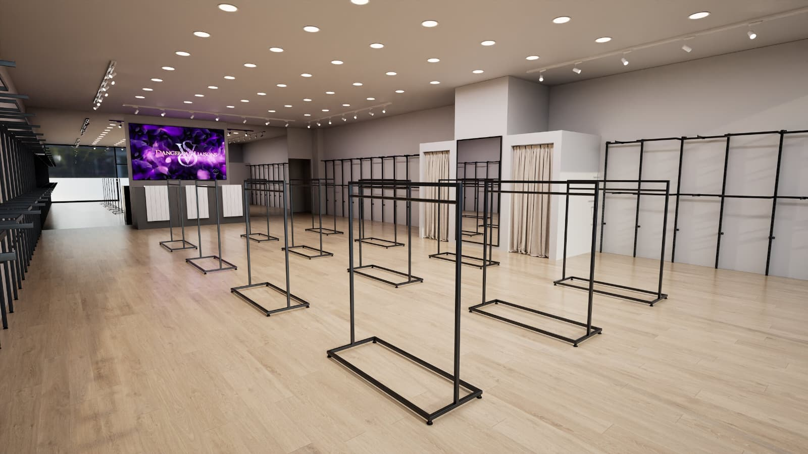

Duvarlar mağazanın stok alanıdır, orta alan ise sahnesi. Müşteri kapıdan girdiğinde gözü önce mağazanın ortasına düşer. Bu alanın nasıl kullanıldığı, müşterinin mağazanın içine kadar yürüyüp yürümeyeceğini belirler.

Bu yazıda orta sistemlerin ne işe yaradığını, hangi türlerin olduğunu ve mağazaya nasıl yerleştirileceğini anlatıyoruz.

## Orta sistem ne işe yarar?

Orta sistemler (orta üniteler) mağazanın ortasında duran, duvara bağlı olmayan teşhir üniteleridir. Üç temel görevi vardır:

1. **Müşteriyi içeri çekmek:** Kapıdan görünen orta ünite müşteriyi mağazanın derinliğine yönlendirir.
2. **Öncelikli ürünü göstermek:** Yeni sezon, kampanya veya en çok satan ürünler için ayrılmış alandır.
3. **Dolaşımı düzenlemek:** Doğru yerleştirilen üniteler müşterinin mağazada izleyeceği yolu belirler.

## Orta ünite türleri

### Askılıklı üniteler
Tek veya çift askı borulu üniteler giyim mağazalarında en çok kullanılan türdür. Askıda duran ürün her iki taraftan görülebilir.

### Raflı ve cam bölmeli üniteler
Katlı ürün, çanta, ayakkabı ve aksesuar için idealdir. Cam raflar ürünü hafif ve ferah gösterir; ahşap raflar sıcak bir hava katar.

### Karma üniteler
Askılık, raf ve cam bölmeyi tek ünitede birleştirir. Aynı ünitede kombin sunmak için en uygun türdür: üstte aksesuar, ortada askıda ürün, altta katlı ürün.

### Kemerli ve dekoratif üniteler
Altın, bakır veya siyah metalden kemerli üniteler butiklerde mağazaya karakter kazandırır. Ürün sergilerken aynı zamanda dekor görevi görür. Farklı modelleri [orta sistemleri](/orta-sistemleri/) sayfasında renk filtresiyle inceleyebilirsiniz.

## Yerleşimde dikkat edilmesi gerekenler

### Geçiş genişliği
Üniteler arasında iki kişinin rahatça yan yana geçebileceği mesafe bırakılmalıdır. Dar geçişler müşteriyi mağazada kısa tutar; alışveriş arabası veya bebek arabası olan müşteriler için ise mağazayı kullanılamaz hâle getirir.

### Yükseklik
Kapıya yakın ünitelerin alçak tutulması mağazanın arka tarafının görünmesini sağlar. Yüksek üniteler mağazanın gerisine doğru yerleştirildiğinde mağaza hem dolu hem ferah görünür.

### Görüş hattı
Kasa ve personelin mağazanın tamamını görebilmesi hem hizmet hem güvenlik açısından önemlidir. Orta üniteler bu görüş hattını kapatmamalıdır.

### Aydınlatma
Orta ünitenin tam üstüne gelen spot, ünitedeki ürünü mağazanın en parlak noktası yapar. Üniteler yerleştirilmeden önce aydınlatma planı gözden geçirilmelidir.

## Orta ünitede ürün düzeni

Doğru ünite kadar, ünitenin üzerine ne konduğu da önemlidir:

- **Üst bölüm:** Çanta, şapka ve aksesuar gibi kombini tamamlayan ürünler.
- **Orta bölüm:** Askıda ana ürün; müşterinin ilk göreceği yer.
- **Alt bölüm:** Katlı ürünler ve farklı renk seçenekleri.

Aynı ünitede tek bir tema veya renk paleti kullanmak, müşterinin ünitenin ne anlattığını bir bakışta anlamasını sağlar.

## Kaç orta ünite gerekir?

Kesin bir sayı mağazanın ölçüsüne ve ürün yoğunluğuna bağlıdır. Genel bir yaklaşım:

- **Küçük butik:** Girişte bir kampanya ünitesi ve ortada bir veya iki karma ünite.
- **Orta büyüklükte mağaza:** Ürün gruplarına göre ayrılmış birkaç ünite ve bir teşhir masası.
- **Büyük mağaza:** Bölümleri birbirinden ayıran ünite grupları ve her bölümün girişinde odak ünitesi.

Ünite sayısını artırmak her zaman satışı artırmaz. Boş alan ürünün değerli görünmesini sağlar.

## Sık yapılan hatalar

1. **Ortayı doldurmak:** Fazla ünite mağazayı depo gibi gösterir.
2. **Duvar sistemleriyle uyumsuz renk:** Orta üniteler duvar sistemleriyle aynı renk dilinde olmalıdır.
3. **Ünitelere kalıcı ürün koymak:** Orta alan sık değişmelidir; müşteri her gelişinde yeni bir şey görmelidir.
4. **Tekerlek ve taşınabilirliği düşünmemek:** Sık yeniden düzenlenen mağazalarda taşınabilir üniteler zaman kazandırır.

## Özetle

| Karar | Neye göre? |
|---|---|
| Ünite türü | Askıda mı, katlı mı, kombin mi sergilenecek |
| Yükseklik | Girişe yakınlık ve görüş hattı |
| Renk ve malzeme | Duvar sistemleri ve marka dili |
| Adet | Mağaza ölçüsü ve geçiş genişliği |

Mağazanızın ölçüsünü gönderin, orta alan için size uygun ünite ve yerleşimi birlikte planlayalım. Tüm modeller için [orta sistemleri](/orta-sistemleri/) sayfasına göz atabilirsiniz.
