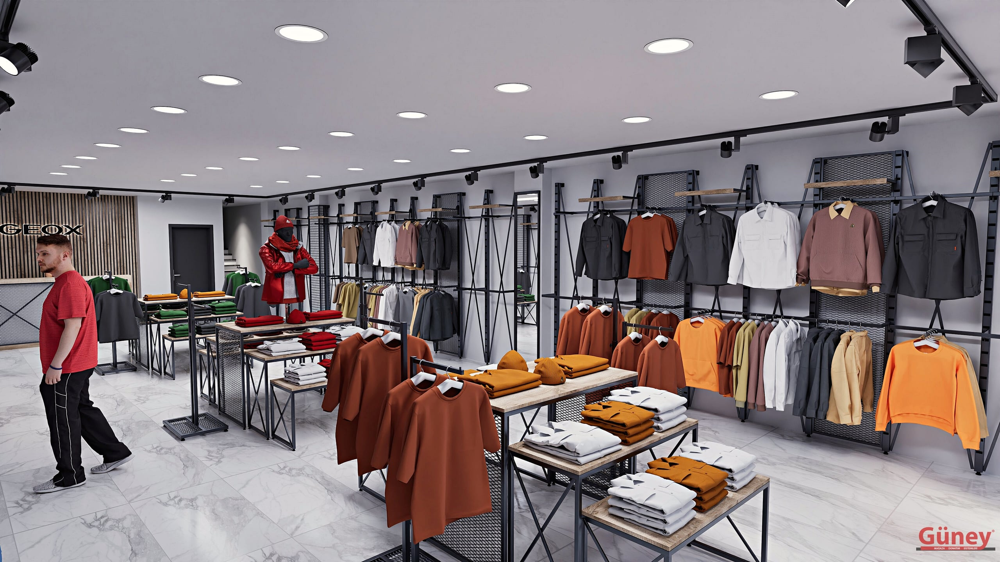

Raf sistemi, mağazada ürünün müşteriyle ilk buluştuğu yerdir. Yanlış seçilen raf ya ürünü saklar ya da mağazayı kalabalık gösterir. Doğru raf ise ürünü öne çıkarır, stok düzenini kolaylaştırır ve mağazaya kurumsal bir görünüm kazandırır.

Aşağıda raf sistemi seçerken sorulması gereken 7 soruyu sırayla ele aldık.

## 1. Ne satıyorsunuz?

Raf seçiminin başlangıç noktası ürün grubudur:

- **Giyim:** Askı borusu ve raf kombinasyonu. Katlı ürünler için raf, askılık ürünler için boru.
- **Ayakkabı:** Eğimli veya düz raflar, sık raf aralığı.
- **Çanta ve aksesuar:** Kanca, ızgara panel ve sığ raflar.
- **Kutulu ürün ve stok:** Derin ve yüksek taşıma kapasiteli raflar.

Tek bir mağazada birden fazla ürün grubu varsa, aynı sistem üzerinde farklı aparatlar kullanmak mağazaya bütünlük kazandırır.

## 2. Duvar mı, depo mu?

Satış alanındaki raf ile depodaki raf aynı işi yapmaz. Satış alanında görünüm ve erişilebilirlik öne çıkar; depoda ise taşıma kapasitesi ve alan verimliliği.

Depo ve stok alanları için [metal depo rafları](/raf-sistemleri/depo-raf/) en pratik çözümdür. Satış alanında ise görünüşe göre boru veya profil sistemler tercih edilir.

## 3. Hangi sistem, hangi görünüm?

### Boru raf sistemi
Endüstriyel ve modern bir görünüm verir. Butikler, spor giyim ve konsept mağazalar için uygundur. Sade yapısı ürünü ön plana çıkarır. [Boru raf sistemlerini inceleyin](/raf-sistemleri/boru-raf/).

### 40×40 raf sistemi
Modüler ve ayarlanabilir yapısıyla en çok tercih edilen sistemlerden biridir. Ağır ürünlerde eğilme yapmaz, raf yükseklikleri sonradan değiştirilebilir. [40×40 raf sistemlerini inceleyin](/raf-sistemleri/40x40-raf/).

## 4. Ne kadar esneklik gerekiyor?

Sezon değiştikçe ürün de değişir. Kışın mont ve kaban askıda dururken yazın katlı tişörtler rafa geçer. Bu yüzden:

- Raf yükseklikleri **ayarlanabilir** olmalı,
- Askı borusu ve raf aynı sisteme **sonradan eklenebilmeli**,
- Ek modül ileride aynı görünümle **tamamlanabilmelidir**.

Modüler sistemler bu açıdan uzun vadede daha ekonomiktir.

## 5. Taşıma kapasitesi

Katlanmış kot, ayakkabı kutusu veya çanta bir süre sonra rafa ciddi yük bindirir. Raf kalınlığı, taşıyıcı profil ve duvar bağlantısı yüke göre seçilmelidir. Özellikle yüksek duvarlarda sabitleme kritik önemdedir; bu yüzden montajın profesyonel ekip tarafından yapılması gerekir.

## 6. Renk ve malzeme uyumu

Siyah metal ve ahşap sıcak ve premium bir görünüm verir; beyaz sistemler ferah ve sade mağazalarda ürünü öne çıkarır; altın ve bakır tonları butiklerde lüks bir hava katar. Orta ünitelerle ve askılarla aynı renk dilini kullanmak mağazanın bütünlüklü görünmesini sağlar.

## 7. Ölçü ve montaj

Hazır ölçülü raflar her mağazaya tam oturmaz; köşelerde boşluk kalır ya da duvar verimsiz kullanılır. Ölçüye göre üretilen sistemler duvarı uçtan uca değerlendirir. Onaydan sonra üretim ortalama 7–15 gün, montaj ise 1–3 gün sürer.

## Aydınlatma ile birlikte düşünün

Raf ne kadar iyi olursa olsun, ürün iyi ışık almıyorsa görünmez. Raf sistemini planlarken:

- Tavan spotlarının rafın önüne düşecek şekilde konumlanmasına,
- Derin raflarda arka kısmın karanlıkta kalmamasına,
- Gerekirse raf altı veya ürün aydınlatması için kablo geçişine

dikkat edin. Açık renkli raf ve sistemler ışığı yansıtarak mağazayı daha aydınlık gösterir.

## Sık yapılan 5 hata

1. **Rafı çok yükseğe kurmak:** Müşterinin ulaşamadığı raflar ölü alandır; üst raflar stok veya görsel teşhir için kullanılmalıdır.
2. **Raf aralığını ürüne göre ayarlamamak:** Kutulu ürün ile katlı tişört aynı aralığa sığmaz.
3. **Sadece fiyata bakmak:** İnce malzeme kısa sürede eğilir; yenilemek ilk yatırımdan pahalıya gelir.
4. **Duvar yapısını kontrol etmemek:** Alçıpan duvarlarda taşıyıcı bağlantı farklı çözümler ister.
5. **Mağazayı rafla doldurmak:** Nefes alan boşluklar ürünü daha değerli gösterir.

## Bakım ve uzun ömür

Metal raf sistemleri doğru kurulduğunda uzun yıllar kullanılır. Ömrünü uzatmak için:

- Raflara kapasitesinin üzerinde yük bindirmeyin.
- Vida ve bağlantıları yılda bir kontrol ettirin.
- Boyalı yüzeyleri aşındırıcı olmayan, nemli bezle temizleyin.
- Raf yerini değiştirirken taşıyıcılara uygun aparatları kullanın.

## Özetle

| Soru | Belirlediği şey |
|---|---|
| Ne satıyorsunuz? | Raf tipi ve aparatlar |
| Duvar mı, depo mu? | Görünüm mü, kapasite mi öncelikli |
| Hangi görünüm? | Boru, 40×40 veya özel sistem |
| Esneklik | Modüler yapı ihtiyacı |
| Yük | Raf kalınlığı ve sabitleme |
| Renk | Mağazanın genel dili |
| Ölçü | Özel üretim gerekliliği |

Mağazanızın ölçüsünü ve ürün grubunuzu gönderin, size en uygun raf sistemini birlikte belirleyelim. Tüm modeller için [raf sistemleri](/raf-sistemleri/) sayfamıza göz atabilirsiniz.
