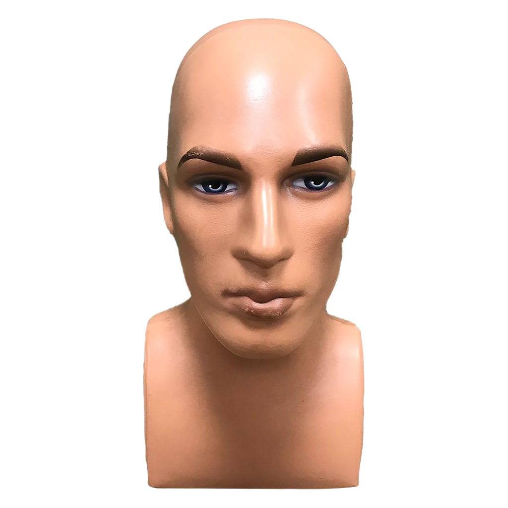

Her ürünü göstermek için tam boy bir mankene gerek yoktur. Bir şapkayı, bir çorabı ya da bir tişörtü sergilemek için bütün bir manken hem fazla yer kaplar hem de ürünün önüne geçer. Parça mankenler tam da bu noktada devreye girer: ürünü göz hizasına taşır, az yer kaplar ve odak noktasını ürünün kendisine çeker.

Bu yazıda parça manken türlerini ve hangi ürün için nasıl kullanılacağını anlatıyoruz.

## Parça manken türleri

### Gövde (torso) manken
Omuzdan beline ya da kalçaya kadar olan bölümü gösterir.

- **En uygun:** Tişört, gömlek, bluz, kazak, iç giyim, mayo.
- **Kullanım yeri:** Raf üstü, tezgâh, teşhir masası, orta ünite.

Gövde mankenleri tam boy mankene göre çok daha az yer kaplar; bu yüzden [küçük mağazalarda](/blog/kucuk-magazada-alan-kazanma/) en çok tercih edilen çözümlerden biridir.

### Manken kafası
Baş ve boyun bölümünü gösterir.

- **En uygun:** Şapka, bere, eşarp, peruk, gözlük, küpe ve takı.
- **Kullanım yeri:** Aksesuar rafı, kasa önü, vitrin detayı.

### Alt beden manken
Belden aşağısını gösterir.

- **En uygun:** Pantolon, şort, etek, tayt, iç giyim.
- **Kullanım yeri:** Teşhir masası, raf üstü, pantolon duvarının önü.

### Bacak ve ayak manken
Bacağın bir bölümünü veya ayağı gösterir.

- **En uygun:** Çorap, külotlu çorap, tayt, ayakkabı.
- **Kullanım yeri:** Çorap ve iç giyim reyonu, ayakkabı rafı.

## Parça mankenin avantajları

1. **Alan tasarrufu:** Zemin yerine raf ve tezgâh üzerinde durur.
2. **Göz hizası:** Ürünü müşterinin doğrudan baktığı seviyeye taşır.
3. **Odak:** Tek bir ürünü öne çıkarır; müşterinin dikkati dağılmaz.
4. **Esneklik:** Hafif olduğu için kolayca yer değiştirir; kampanyalara göre hızla güncellenir.
5. **Maliyet:** Genellikle tam boy mankene göre daha ekonomiktir; aynı bütçeyle daha fazla sunum noktası oluşturulabilir.

## Doğru kullanım için ipuçları

- **Gruplayın:** Aynı raf üzerinde iki veya üç gövde manken, tek bir mankene göre daha güçlü bir sunum yaratır.
- **Farklı yükseklikler kullanın:** Kaide veya raf farkıyla mankenleri farklı seviyelere yerleştirmek derinlik kazandırır.
- **Ürüne göre boy seçin:** Çocuk ürünleri için çocuk ölçülerinde, büyük beden ürünler için uygun ölçüdeki mankenleri tercih edin.
- **Rengi uyumlu tutun:** Beyaz, ten rengi veya siyah; mağazadaki diğer mankenlerle aynı renk ailesinde kalmak bütünlük sağlar.

## Tam boy ile birlikte kullanım

En etkili sunum tam boy ve parça mankenlerin birlikte kullanıldığı sunumdur:

- **Vitrinde** tam boy mankenlerle bütün kombini gösterin.
- **Mağaza içinde** aynı ürün grubunu raf üzerinde gövde mankenle tekrar edin.
- **Aksesuar alanında** manken kafası ve bacak mankeniyle kombini tamamlayan ürünleri sergileyin.

Tam boy manken seçimi için [plastik mi polyester manken mi](/blog/plastik-mi-polyester-manken-mi/) yazımıza göz atabilirsiniz.

## Bakım ve temizlik

Parça mankenler sık elle tutulduğu için temiz görünmeleri önemlidir:

- Plastik yüzeyleri nemli ve yumuşak bir bezle silin; aşındırıcı temizleyici kullanmayın.
- Gövde mankenlerine kıyafet giydirirken yüzeyi çizebilecek fermuar ve metal aksesuarlara dikkat edin.
- Manken kafalarında kullanılan peruk ve aksesuarları düzenli olarak yenileyin; yıpranmış bir peruk ürünü de eski gösterir.
- Kullanılmayan mankenleri üst üste yığmak yerine ayakta veya ayrı ayrı saklayın.

Düzenli bakılan bir manken yıllarca ilk günkü görünümünü korur ve ürünün değerini yansıtır.

## Özetle

| Parça manken | Ürün | Nerede? |
|---|---|---|
| Gövde | Üst giyim, iç giyim | Raf, tezgâh, orta ünite |
| Kafa | Şapka, eşarp, gözlük, takı | Aksesuar alanı, kasa önü |
| Alt beden | Pantolon, etek, tayt | Teşhir masası, raf |
| Bacak ve ayak | Çorap, ayakkabı | Çorap reyonu, ayakkabı rafı |

Gövde, kafa, alt beden ve bacak modellerini [plastik manken](/mankenler/plastik-manken/) sayfasında **Tip** filtresiyle kolayca bulabilirsiniz.
