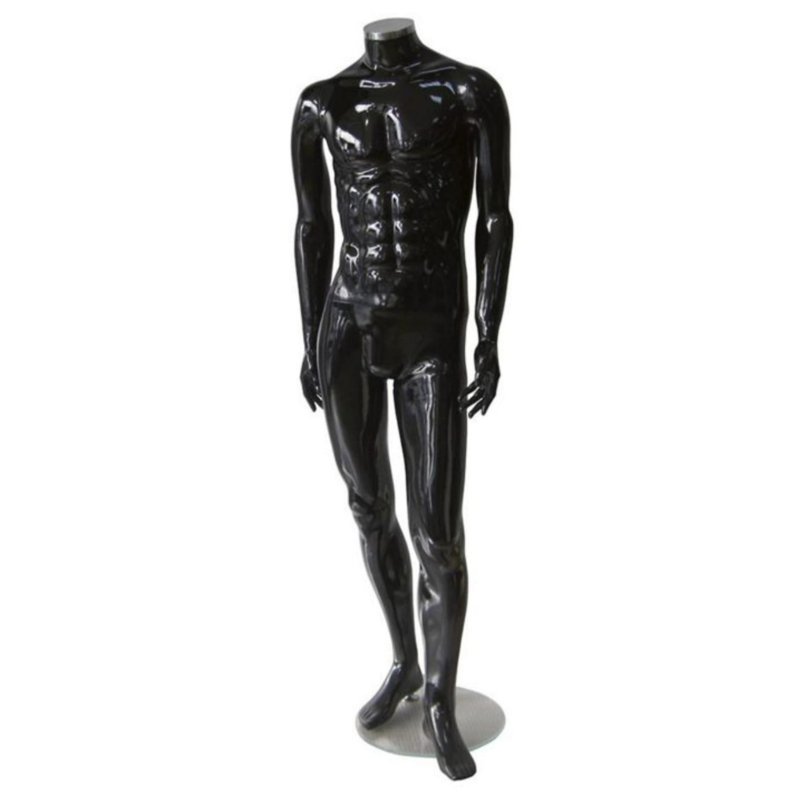

Vitrin mankeni, mağazanın dışarıya verdiği ilk mesajdır. Yoldan geçen müşteri önce vitrindeki kombini görür, sonra içeri girip girmeyeceğine karar verir. Bu yüzden mankenin malzemesi, rengi ve formu en az üzerindeki kıyafet kadar önemlidir.

Mağazalarda en çok kullanılan iki vitrin mankeni türü plastik ve polyester mankenlerdir. Hangisinin size uygun olduğunu birkaç soruyla netleştirebilirsiniz.

## Plastik manken: hafif, dayanıklı ve ekonomik

[Plastik mankenler](/mankenler/plastik-manken/) hafif yapıları ve darbelere dayanıklılıklarıyla öne çıkar:

- **Kolay taşınır:** Vitrin sık değişiyorsa büyük avantajdır.
- **Kolay temizlenir:** Yoğun müşteri trafiği olan mağazalarda pratiktir.
- **Ekonomiktir:** Çok sayıda mankene ihtiyaç duyan mağazalar için uygun maliyetlidir.
- **Çeşitlidir:** Tam boyun yanında gövde, kafa, alt beden ve bacak modelleri bulunur.

### Parça mankenler ne işe yarar?
Her ürün için tam boy manken gerekmez:

- **Gövde (torso):** Tişört, gömlek, iç giyim; raf ve tezgâh üzerinde.
- **Kafa:** Şapka, eşarp, peruk, gözlük ve aksesuar.
- **Alt beden:** Pantolon, şort, tayt ve iç giyim.
- **Bacak:** Çorap ve külotlu çorap teşhiri.

Parça mankenler az yer kaplar ve ürünü göz hizasına taşır.

## Polyester manken: premium görünüm

[Polyester mankenler](/mankenler/polyester-manken/) vitrine daha iddialı ve şık bir görünüm kazandırır:

- **Yüzey seçenekleri:** Parlak ve mat yüzeyler; altın, gümüş, siyah, beyaz ve ten rengi seçenekleri.
- **Gerçekçi form:** Anatomik hatları kıyafetin duruşunu doğal gösterir.
- **Dayanıklı yüzey:** Darbe ve çizilmeye dayanıklı yapısıyla uzun süre ilk günkü görünümünü korur.

Altın veya gümüş parlak yüzeyli bir manken, sade kıyafetleri bile vitrinde dikkat çekici kılar. Kadın, erkek ve çocuk modellerini [polyester manken](/mankenler/polyester-manken/) sayfasında renk filtresiyle inceleyebilirsiniz.

## Hangisini seçmelisiniz?

| Kriter | Plastik | Polyester |
|---|---|---|
| Görünüm | Sade, işlevsel | Premium, dikkat çekici |
| Ağırlık | Hafif | Hafif |
| Renk ve yüzey | Beyaz ve ten rengi ağırlıklı | Parlak ve mat, metalik tonlar |
| En uygun yer | Mağaza içi, yoğun kullanım, e-ticaret çekimi | Vitrin, butik, showroom |
| Parça seçenekleri | Gövde, kafa, alt beden, bacak | Tam boy ağırlıklı |

### Birlikte kullanmak
Pek çok mağaza iki türü birlikte kullanır: vitrinde polyester mankenlerle güçlü bir ilk izlenim, mağaza içinde ise plastik gövde ve alt beden mankenleriyle ürün yoğunluğu yüksek bir sunum.

## Vitrin düzeninde mankeni doğru kullanmak

- **Tek sayıda manken:** Vitrinde üç veya beş manken, çift sayıya göre daha dinamik bir kompozisyon oluşturur.
- **Farklı yükseklikler:** Mankenleri kaide veya platformlarla farklı seviyelere yerleştirmek derinlik hissi verir.
- **Hikâye anlatın:** Aynı temadaki kombinleri yan yana koymak (ör. ofis, hafta sonu, gece) müşteriye fikir verir.
- **Az ama güçlü:** Vitrini kalabalık yapmak yerine birkaç güçlü kombin seçin.
- **Düzenli yenileyin:** Vitrini sezonda birkaç kez değiştirmek, düzenli gelen müşteriye yenilik mesajı verir.

## Temizlik ve bakım

- Parlak yüzeyli polyester mankenleri yumuşak, tüy bırakmayan bezle silin; aşındırıcı temizleyici kullanmayın.
- Plastik mankenler nemli bezle kolayca temizlenir.
- Mankeni taşırken kol ve bağlantı noktalarından değil, gövdeden tutun.
- Kıyafet giydirirken önce kol ve bağlantı parçalarını çıkarmak hem mankeni hem kıyafeti korur.

## Kaç manken gerekir?

Manken sayısı mağaza büyüklüğüne ve ürün yoğunluğuna göre değişir. Genel yaklaşım:

- **Vitrin:** Vitrin genişliğine göre bir ila beş tam boy manken.
- **Mağaza içi:** Her ana ürün grubu için en az bir sunum noktası; burada gövde ve alt beden mankenleri alan tasarrufu sağlar.
- **Kampanya alanı:** Orta ünitelerin yanında bir veya iki manken, kampanya ürününü öne çıkarır.

## Satın almadan önce 4 kontrol

1. **Kıyafet bedeni:** Mankenin bedeni sattığınız ürünlerin ölçü aralığına uymalı.
2. **Poz:** Vitrindeki kombinin hareketine göre düz, adımlı veya kolu bükük poz seçin.
3. **Taban:** Cam veya metal taban mankenin sabit durmasını sağlar; vitrin zemininizi kontrol edin.
4. **Renk uyumu:** Mankenin rengi markanın renkleri ve vitrin ışığıyla uyumlu olmalı.

Toplu alımlarda modelleri katalog numaralarıyla teklif listesine ekleyip adetleriyle birlikte tek mesajda gönderebilirsiniz. Tüm modeller için [mankenler](/mankenler/) sayfasına göz atın.
