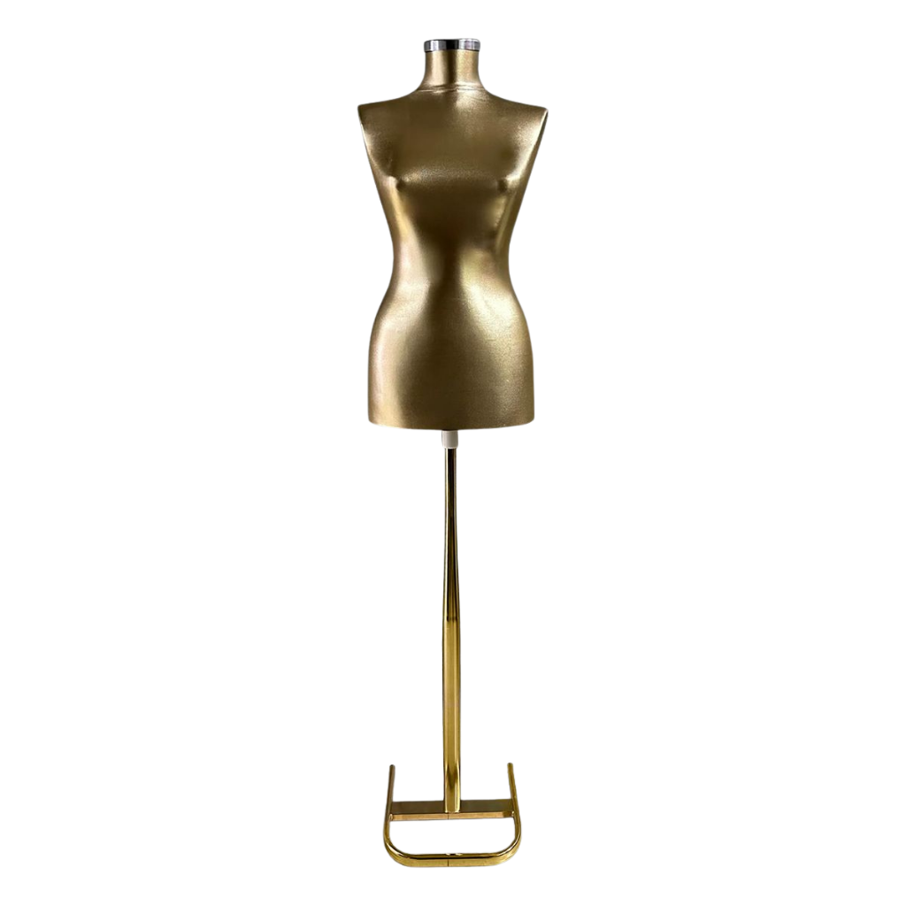

Terzi mankeni, atölyede en çok kullanılan ekipmanlardan biridir. Prova, ölçü, kalıp ve drapaj çalışmalarının doğruluğu büyük ölçüde mankenin kalitesine bağlıdır. Yanlış seçilen bir manken kıyafetin gerçek bedende nasıl duracağını yanıltıcı gösterir.

Bu rehberde terzi mankeni seçerken nelere bakmanız gerektiğini anlatıyoruz.

## Terzi mankeni ile vitrin mankeni arasındaki fark

İkisi sıkça karıştırılır ama işlevleri farklıdır:

- **Terzi mankeni** çalışmak için tasarlanır: gövdesine iğne batırılabilir, çoğunlukla ayarlanabilir bir ayağı vardır ve beden oranları prova için gerçekçidir.
- **Vitrin mankeni** (plastik veya polyester) ürün sergilemek içindir; poz, yüzey ve görünüm önceliklidir.

Vitrin mankenleri hakkında ayrıntılı bilgi için [plastik mi polyester manken mi](/blog/plastik-mi-polyester-manken-mi/) yazımıza göz atabilirsiniz.

## 1. Kadın mı, erkek mi?

Atölyenizin ağırlıklı olarak hangi ürünlerle çalıştığına göre karar verin:

- **Kadın terzi mankeni:** Elbise, abiye, bluz, etek ve ceket provası. [Kadın terzi mankenleri](/mankenler/terzi-mankeni/kadin/)
- **Erkek terzi mankeni:** Takım elbise, ceket, gömlek ve pantolon kalıbı. [Erkek terzi mankenleri](/mankenler/terzi-mankeni/erkek/)

Hem kadın hem erkek dikim yapan atölyelerde iki mankeni birlikte bulundurmak provada zaman kazandırır.

## 2. Kollu mu, kolsuz mu?

Bu, terzi mankeni seçiminde en sık sorulan sorudur.

### Kollu terzi mankeni
Hareketli kolları sayesinde ceket, gömlek ve kollu modellerin provası çok daha doğru yapılır. Kol evi, omuz düşüklüğü ve kol boyu gerçekçi şekilde görülür.

### Kolsuz terzi mankeni
Giydirmesi hızlıdır. Elbise, abiye, yelek ve kolsuz modellerle çalışırken pratiklik sağlar. Kolların gerekmediği işlerde daha az yer kaplar.

> **Pratik kural:** Ceket ve gömlek çalışıyorsanız kollu, ağırlıklı olarak elbise ve abiye çalışıyorsanız kolsuz model seçin.

## 3. Ayak ve taban

Mankenin ayağı sabit duruşu ve çalışma yüksekliğini belirler:

- **Ahşap tripod ayak:** Sağlam ve estetiktir; vitrinde de şık durur.
- **Metal ayak:** İnce ve modern bir görünüm verir.
- **Yüksekliği ayarlanabilir ayak:** Farklı boylarda çalışan terziler ve etek boyu ayarı için önemlidir.

## 4. Gövde ve kaplama

Gövdenin iğne tutması ve kumaşın kaymaması provanın hızını belirler. Kumaş kaplı gövdeler iğneyi iyi tutar ve kumaşın kaymadan yerleşmesini sağlar. Kaplamanın rengi (krem, siyah, gri) daha çok tercih meselesidir; açık renkler koyu kumaşlarla çalışırken kontrastı artırır.

## 5. Beden ve oranlar

Mankenin bedeni çalıştığınız ölçü aralığına uygun olmalıdır. Gerçekçi oranlara sahip bir manken, dikilen kıyafetin insan bedenindeki duruşunu doğru gösterir; kalıp ve provada hata payını azaltır.

## 6. Kullanım yeri

- **Atölye:** Dayanıklılık, iğne tutuşu ve ayarlanabilir ayak öncelikli.
- **Moda okulu:** Çok sayıda öğrencinin kullanacağı, sağlam ve standart modeller.
- **Butik vitrini:** Görünüm öncelikli; ahşap ayaklı ve kumaş kaplı modeller dekoratif olarak da kullanılır.

## Kullanım ve bakım ipuçları

Terzi mankeni doğru kullanıldığında uzun yıllar formunu korur:

- **İğneleri yatay batırın:** Gövde kaplamasının yıpranmasını azaltır.
- **Ayağı düz zeminde kullanın:** Tripod ayak eğimli zeminde sallanır ve ölçüyü yanıltır.
- **Kumaş kaplamayı nemden koruyun:** Nemli ortam kaplamanın gerginliğini bozabilir.
- **Tozdan koruyun:** Kullanılmadığında üzerini örtmek kaplamanın rengini korur.
- **Kol bağlantılarını zorlamayın:** Kollu modellerde kolları kendi hareket açısında kullanın.

## Sık yapılan hatalar

1. **Sadece görünüşe göre seçmek:** Vitrinde güzel duran her manken atölyede iyi çalışmaz; iğne tutuşu ve beden oranı önceliklidir.
2. **Tek manken ile her bedeni çalışmaya çalışmak:** Çok farklı beden aralıklarıyla çalışan atölyelerde ikinci bir manken zaman kazandırır.
3. **Ayak yüksekliğini hesaba katmamak:** Etek ve elbise boyu ayarında yüksekliği ayarlanabilir ayak büyük kolaylık sağlar.

## Birden fazla manken gerekiyor mu?

Atölyenizde aynı anda birden fazla prova yapılıyorsa ya da hem kadın hem erkek dikim çalışıyorsanız, iş akışını bölmemek için birden fazla manken bulundurmak verimliliği artırır. Moda okulları ve üretim atölyeleri genellikle aynı modelden birkaç adet tercih eder; böylece çalışmalar standart ölçüler üzerinden ilerler.

## Özet

| Karar | Seçenekler | Neye göre? |
|---|---|---|
| Cinsiyet | Kadın / erkek | Ağırlıklı çalıştığınız ürünler |
| Kol | Kollu / kolsuz | Ceket-gömlek mi, elbise-abiye mi |
| Ayak | Ahşap / metal, ayarlı | Sabitlik ve çalışma yüksekliği |
| Kullanım | Atölye / okul / vitrin | Dayanıklılık mı görünüm mü |

[Terzi mankeni modellerimizin tamamını](/mankenler/terzi-mankeni/) kollu ve kolsuz filtreleriyle inceleyebilir, beğendiğiniz modelleri katalog numarasıyla teklif listesine ekleyebilirsiniz.
