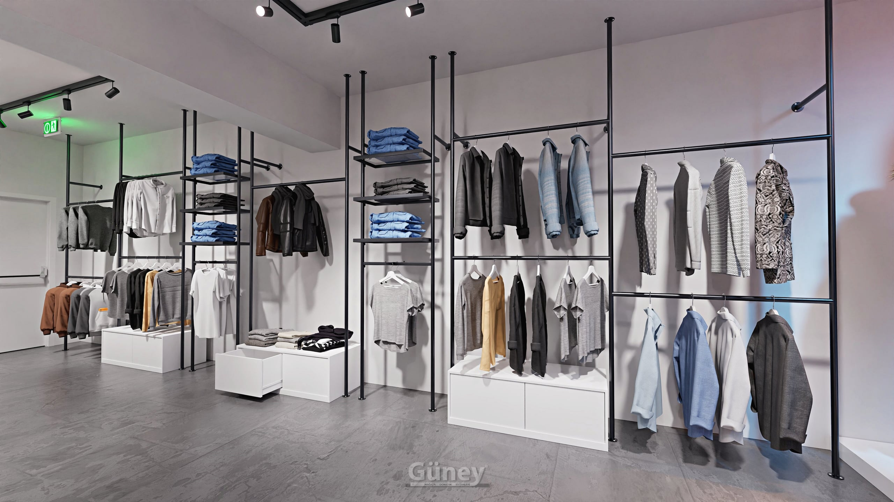

Vitrin, mağazanın sokaktaki reklamıdır. Yoldan geçen biri vitrine birkaç saniye bakar ve o birkaç saniyede içeri girip girmeyeceğine karar verir. İyi bir vitrin çok ürün göstermez; doğru ürünü doğru şekilde gösterir.

Aşağıda vitrini satışa dönüştürmek için uygulayabileceğiniz 9 öneri var.

## 1. Tek bir hikâye anlatın

Vitrinde her ürün grubundan bir parça koymak yerine tek bir tema seçin: "yeni sezon", "ofis şıklığı", "hafta sonu" veya "okula dönüş". Tema, müşterinin vitrine baktığında ne göreceğini anlamasını kolaylaştırır.

## 2. Az ürün, güçlü kombin

Kalabalık vitrin göz yorar. Birkaç güçlü kombin, yan yana dizilmiş onlarca üründen daha fazla dikkat çeker. Boşluk ürünün değerli görünmesini sağlar.

## 3. Mankenleri tek sayıda ve farklı seviyelerde kullanın

Üç veya beş manken, çift sayıya göre daha doğal ve hareketli bir kompozisyon oluşturur. Mankenleri kaide veya platformlarla farklı yüksekliklere yerleştirmek vitrine derinlik kazandırır.

## 4. Mankenin rengini ürüne göre seçin

- **Altın ve gümüş parlak mankenler** sade kıyafetleri bile dikkat çekici kılar.
- **Beyaz mankenler** renkli ürünleri canlı gösterir.
- **Siyah mankenler** açık renkli ve beyaz kıyafetlerde güçlü bir kontrast yaratır.
- **Ten rengi mankenler** kıyafetin insan üzerindeki görünümüne en yakın sunumu sağlar.

Farklı renk seçeneklerini [polyester manken](/mankenler/polyester-manken/) sayfasında renk filtresiyle inceleyebilirsiniz.

## 5. Işık, vitrinin yarısıdır

En iyi kurulmuş vitrin bile karanlıkta kalırsa görünmez. Vitrin için:

- Ürünü önden ve hafif yukarıdan aydınlatan spotlar kullanın.
- Akşam saatlerinde vitrin ışığını açık tutun; kapalı mağazanın vitrini de reklamdır.
- Arka duvardaki ışıklı panolar vitrine derinlik katar.

## 6. Göz hizasını değerlendirin

Vitrinde en değerli alan yoldan geçen birinin göz hizasıdır. Kampanya ürününü veya en güçlü kombini bu seviyeye yerleştirin. Aksesuarlar için alçak kaideler veya [manken kafası ve gövde mankenleri](/mankenler/plastik-manken/) kullanılabilir.

## 7. Fiyat ve kampanya bilgisini sade tutun

Kampanya varsa tek ve okunaklı bir işaretle duyurun. Vitrini afişlerle doldurmak ürünü gölgeler.

## 8. Vitrinden mağazanın içine köprü kurun

Vitrinde gösterilen ürün mağazaya girer girmez bulunabilmelidir. Vitrindeki kombinin girişteki [orta ünitede](/orta-sistemleri/) tekrar edilmesi, müşterinin ilgisini satışa dönüştürür.

## 9. Düzenli yenileyin

Aynı vitrin haftalarca kalırsa önünden her gün geçen müşteri artık onu görmez. Sezon başlarında vitrini tamamen yenileyin; arada küçük değişikliklerle (renk, aksesuar, manken pozu) canlı tutun.

## Yıllık vitrin takvimi

Vitrini yenilemek için sezon ve özel günler iyi birer bahanedir. Örnek bir takvim:

| Dönem | Vitrin teması |
|---|---|
| Ocak | Sezon sonu indirim |
| Şubat–Mart | İlkbahar yeni sezon |
| Mayıs | Anneler Günü |
| Haziran | Babalar Günü, yaz sezonu |
| Ağustos–Eylül | Okula dönüş, sonbahar yeni sezon |
| Kasım | Kampanya dönemi |
| Aralık | Yılbaşı ve hediye |

Bu takvimi kendi ürün gruplarınıza göre uyarlayarak vitrinin yıl boyunca canlı kalmasını sağlayabilirsiniz.

## Vitrin kontrol listesi

- [ ] Vitrinin tek bir teması var mı?
- [ ] Ürün sayısı az ve kombinler net mi?
- [ ] Mankenler farklı seviyelerde mi?
- [ ] Ürün göz hizasında ve iyi aydınlatılmış mı?
- [ ] Vitrindeki ürün mağazanın girişinde de var mı?
- [ ] Cam temiz, fiyat ve kampanya işareti sade mi?

## Sık yapılan hatalar

1. **Vitrini depo gibi kullanmak:** Stok fazlası ürünleri vitrine koymak mağazanın değerini düşürür.
2. **Mankeni eksik giydirmek:** Aksesuarsız veya bol duran kıyafet profesyonel görünmez; kıyafeti mankene göre toplamak gerekir.
3. **Hasarlı manken kullanmak:** Çizilmiş veya kırık bir manken markanın özenini sorgulatır.
4. **Işığı unutmak:** Gündüz iyi görünen vitrin akşam karanlıkta kalabilir.

Vitrininiz için manken ve teşhir ekipmanı ararken [mankenler](/mankenler/) sayfasını inceleyebilir, modelleri teklif listesine ekleyip adetleriyle gönderebilirsiniz.
